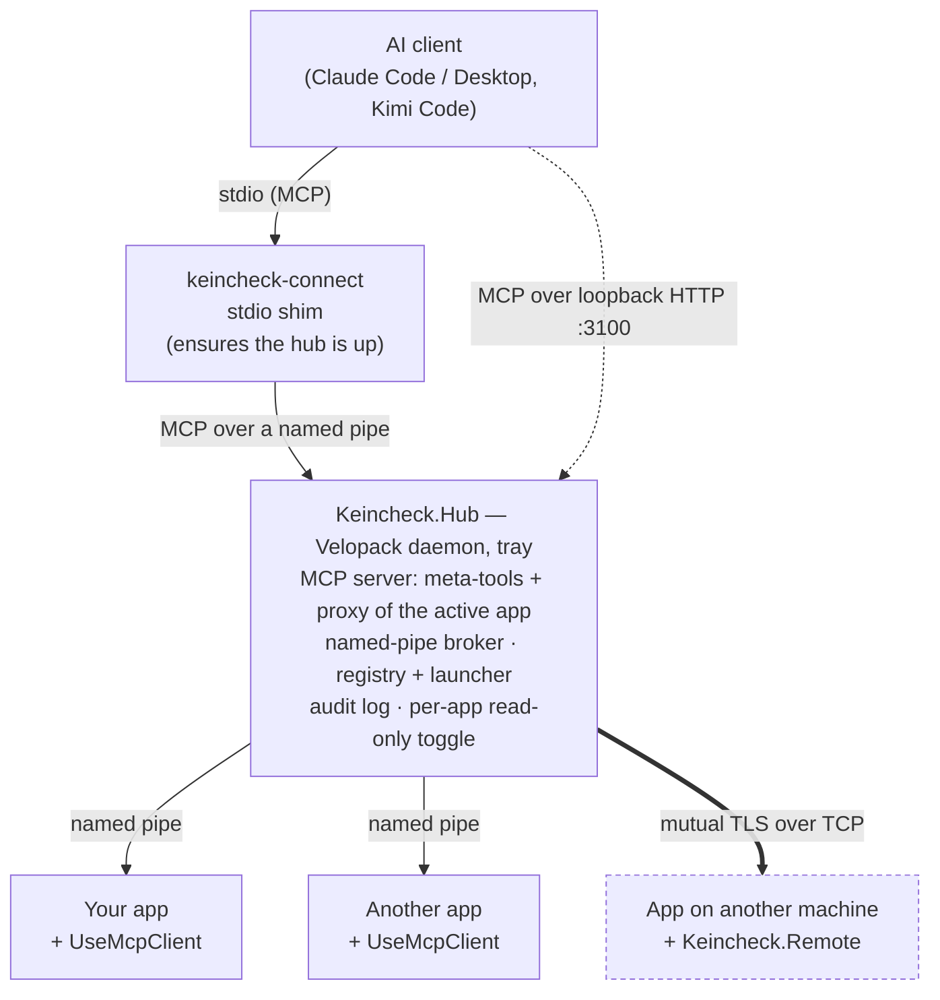

# Keincheck

[](https://github.com/DVSProductions/Keincheck/blob/main/LICENSE)
[](https://github.com/DVSProductions/Keincheck/releases)


**Let an AI see and drive any [Avalonia](https://avaloniaui.net) app.** Keincheck
exposes a [Model Context Protocol](https://modelcontextprotocol.io) (MCP) server over
your running Avalonia 12 UI — list windows, walk the visual/logical tree, read and
write control properties, invoke controls through UI Automation, send synthetic input,
capture screenshots, and read binding errors.

**Supported UI frameworks:** Avalonia 12 and WPF. The introspection engine
is framework-free and reaches the UI through a single neutral seam (`IUiAdapter`), so new
toolkits plug in as adapter packages without touching the engine.

> ### ✨ New — drive apps on *other machines*
>
> Until now the hub could only see apps on its own box. **[`Keincheck.Remote`](#remote) lets it
> broker apps running anywhere**: inspect and drive an Avalonia app on a headless device, a
> test rig, or a laptop across the room — from the same AI session, through *exactly the same
> tools*. A remote client is just a client that happens to have a host:
>
> ```
> myapp#1                 ← local
> myapp@MACHINENAME#1      ← the machine on the bench
> ```
>
> Mutually-authenticated TLS with a hub-owned certificate authority, read-only until you say
> otherwise, and **opt-in by package** — an app that does not reference `Keincheck.Remote`
> links no networking code at all. [Set it up →](#remote)

Two deployment models share one introspection engine:

| | **Broker** (recommended) | **Embedded** |
|---|---|---|
| Server | A standalone **Hub** daemon — one MCP server for many apps | One MCP server **inside** your app |
| Your app pulls in | an adapter pkg, e.g. `Keincheck.Avalonia` (named-pipe, **no ASP.NET**) | `Keincheck` (Kestrel in-process) |
| Transport to the AI | stdio shim → hub (auto-starts the hub) | loopback HTTP `http://127.0.0.1:3001` |
| Extras | launch/restart apps, multi-app routing, tray + audit + read-only toggle | none — zero infrastructure |
| Use when | you want a clean, reusable, multi-app setup | you want a single app wired in one line |

## Quick start — broker

1. **Install the Hub** from the [latest release](https://github.com/DVSProductions/Keincheck/releases)
   (a self-updating [Velopack](https://velopack.io) app) — see [Platforms](#platforms) for
   which asset to grab.
2. **Add the client** to your Avalonia app and give it a stable id:
   ```csharp
   using Keincheck.Avalonia;   // Avalonia adapter package — supplies UseMcpClient

   AppBuilder.Configure<App>()
       .UsePlatformDetect()
       .UseMcpClient(o => o.AppId = "myapp");   // connects to the hub over a named pipe
   ```
3. **Point your MCP client at the stdio shim** — e.g. a project `.mcp.json`:
   ```json
   { "mcpServers": { "keincheck-hub": { "type": "stdio", "command": "keincheck-connect" } } }
   ```
   The shim ensures the hub is running and bridges stdio ↔ hub.
4. **Drive it:** `hub_list_clients` → `hub_select_client("myapp#1")` → then the per-app
   tools (`list_windows`, `screenshot_window`, `set_property`, …) operate on your app.

## Quick start — embedded

```csharp
AppBuilder.Configure<App>()
    .UsePlatformDetect()
    .UseMcpServer();          // MCP server on http://127.0.0.1:3001
```

Point any MCP-capable client at `http://127.0.0.1:3001`.

## Architecture (broker)



Tools execute **inside each app** (where the UI toolkit lives, reached through that app's
`IUiAdapter`); the hub is a framework-agnostic multiplexer that advertises the active
client's tools and forwards calls to the owning client.

**Two ways in.** The stdio shim is the usual one and the only one that can start a hub that
is not running. The hub *also* serves MCP directly over loopback HTTP on **`127.0.0.1:3100`**,
which is useful for a client that speaks HTTP natively or when you want to attach without
spawning a shim. Both surfaces expose the same tools and share the same broker.

Apps on other machines attach over [mutual TLS](#remote) and are addressed as
`appid@host#n` — same tools, no separate code path.

## Tools

**Per-app UI tools** (run in the app, proxied by the hub): `list_windows`,
`get_logical_tree`, `get_visual_tree`, `query_controls`, `get_properties`, `get_property`,
`get_data_context`, `get_text`, `get_binding_errors`, `hit_test`, `get_focused_element`,
`screenshot_window`, `screenshot_control`, `set_property`, `automation_action`, `set_focus`,
`wait_for`, `pointer` / `click_at`, `scroll_at`, `type_text`, `send_keys`.

**Hub meta-tools** — always present, whichever app is active. Start with `hub_guide`, which
returns the whole workflow as a document the model can read before touching anything.

| | |
|---|---|
| *Discover & select* | `hub_guide`, `hub_list_clients`, `hub_list_known_clients`, `hub_client_status`, `hub_select_client`, `hub_wait_for_client`, `hub_status` |
| *Lifecycle* | `hub_launch_client`, `hub_restart_client` |
| *Permissions* | `hub_set_readonly` — allow or refuse mutating tools per client |
| *[Sharing a hub](#several-agents-at-once)* | `hub_claim_client`, `hub_release_client` — who may drive an app when several agents are connected |
| *Record & replay* | `hub_record_start`, `hub_record_stop`, `hub_record_status`, `hub_replay`, `hub_export_test` |
| *Static tooling* | `hub_list_client_tools`, `hub_call_tool` — discover and call a client's tools by name, for agents that don't support dynamic tool lists |
| *[Remote](#remote)* | `hub_remote_status`, `hub_remote_enable`, `hub_remote_disable`, `hub_remote_issue`, `hub_remote_revoke` |

Remote adds **no new tools for driving** — a remote app is addressed and driven exactly like a
local one. The `hub_remote_*` tools only administer the listener and its credentials.

**Static tooling mode.** Some agents ignore `notifications/tools/list_changed`, so client tools
added when an app connects never appear for them. Start the hub with `--static-tools` (or
`KEINCHECK_STATIC_TOOLS=1`) and the advertised list never changes: only the meta-tools are
offered, and no list-changed notifications are sent. Discover a client's tools with
`hub_list_client_tools` and invoke them through `hub_call_tool` instead:

```jsonc
hub_call_tool({ "tool": "query_controls", "args": { "selector": "Button" } })
// "client" targets a specific client; omit it to use the active one.
```

<a id="several-agents-at-once"></a>
### Several agents at once

The hub is **one process per machine user**, so every AI agent running as you shares it —
several editor windows, a CI job, whatever else is open. That is deliberate (one place that
knows about every app), and the hub keeps them out of each other's way:

- **Selection is per agent.** Each MCP session has its own active client, its own advertised
  tool list, and its own recording. One agent calling `hub_select_client` never retargets
  another's calls. `hub_status` reports your own selection plus your agent label.
- **One driver per app instance.** Reads stay open to everyone; the first *mutating* call
  claims that instance, and it is released when you disconnect (or via `hub_release_client`).
  A second agent's write fails with a structured `client_claimed` error naming the owner and
  listing the ways out. Apps cannot safely take input from two drivers — pointer capture,
  focus and control handles are all process-global — so this is enforced rather than assumed.
- **Launch affinity for worktrees.** The common setup is one worktree per agent, each with its
  own build of the same app. Pass `exePath` to `hub_launch_client` to start *your* build; the
  hub remembers who asked, selects and claims that instance for you alone, and returns a
  `launchId` so `hub_wait_for_client { launchId }` resolves exactly it — where waiting on
  `appId` might hand you a colleague's copy.

The tray window shows every connected agent and what each is driving, and each client row has
a **Release** button that frees an app whose agent went away without releasing it. Set
`EnforceWriteClaims = false` to turn the driving rule off entirely.

#### Upgrading from 0.11

Single-agent use is unchanged, but four behaviours moved. All four were previously
hub-wide and are now per-agent or stricter:

- **Recordings belong to your session** and are discarded when it ends. Call
  `hub_export_test` before disconnecting if you want to keep one. Previously the buffer was
  hub-wide and outlived the agent that made it.
- **`hub_status.activeClientId` is your own selection**, not the hub's. A second agent
  selecting a different app no longer changes what your calls target.
- **`hub_restart_client` with a bare app id is refused when several instances are running.**
  It used to silently start another copy, leaving you driving an instance you never asked
  for. Name the instance (`myapp#2`), or restart is unambiguous with only one running.
- **A second agent's mutating calls are refused** with a structured `client_claimed` error
  while another agent is driving that instance. Reads are unaffected.

One change is in an adapter package rather than the hub, and it affects **WPF apps only**:

- **`click_at`, `pointer` and `scroll_at` now deliver one event instead of two.** The WPF
  adapter raised both the button-specific mouse event and the generic one, and WPF promotes
  the generic one back into the button-specific event — so every synthetic click arrived
  twice. If a script was written against the doubled behaviour (a counter that advanced two
  steps per click, say), it will now see one. UI-Automation driving (`automation_action`) was
  never affected, and Avalonia was never affected.

A client built against 0.11 works unchanged against a 0.12 hub, and vice versa: the only
wire change is one optional field, and a hub that does not receive it falls back to matching
a launch on process id.

**Addressing:** stable per-session handles (`ctl-1a`) plus a CSS-ish selector engine
(`Button[Name=Save]`, `#Save`, `.toolGroup`, `Button.primary`, `StackPanel > TextBox`).
The `.class` selector matches author style-class membership (Avalonia `Classes="…"`);
frameworks without style classes match nothing.

## Remote

By default the hub only sees apps on its own machine — the control pipe is a local,
current-user-only channel. **`Keincheck.Remote` lets a hub broker apps running elsewhere**:
inspect and drive an Avalonia app on another box from the AI session on yours, through the
same tools. A remote client is just a client that happens to have a host.

**It is a separate package on purpose.** An app that does not reference `Keincheck.Remote`
links no socket or TLS code at all, so remote debuggability can never be switched on by
accident or left behind as latent attack surface. And a hub only listens once an operator
explicitly enables it.

### Setting it up

**1. Turn on the listener** (hub tray ▸ *Remote access…*, or `hub_remote_enable`). The first
time, this generates the hub's own certificate authority.

**2. Issue a credential** for the machine that will connect. **The hub is the only thing that
issues them** — it owns the certificate authority — and there are three ways to ask, which
compose rather than compete.

**(a) Just ask for one.** From the AI, the hub window, or a shell:

```
hub_remote_issue { "target": "MACHINENAME" }
```

```sh
Keincheck.Hub.exe --issue-credential --target MACHINENAME --out cred.txt
```

All three carry the same authorization — anything running as you — so none is privileged over
the others. The command works whether or not a hub is running: it asks the running hub when
there is one, and reads the store directly when there is not.

**(b) Let the build ask, when nothing is available.** Opt in and the build calls the installed
hub for you:

```xml
<PropertyGroup>
  <KeincheckRemoteEnroll>true</KeincheckRemoteEnroll>
  <KeincheckRemoteTarget>MACHINENAME</KeincheckRemoteTarget>
</PropertyGroup>
```

It writes to `obj/` (never the source tree), embeds the result as the
`Keincheck.Remote.Credential` resource, reuses the existing one until it nears expiry, and
**warns rather than failing** when there is no hub — a build machine without one must not break.

**(c) Ask once yourself, then point the build at it.** The CI case: get a credential with (a),
store it as a secret, and hand the build the path.

```xml
<PropertyGroup>
  <KeincheckRemoteCredentialFile>$(CI_SECRET_PATH)</KeincheckRemoteCredentialFile>
</PropertyGroup>
```

`KEINCHECK_REMOTE_FILE` works too. **(c) always wins over (b)** — if you supplied a credential
the build will never quietly mint a different one — and a supplied path that does not exist is
a hard error rather than a silent fallback.

Never commit a credential. Build-issued ones default to 90 days, hand-issued to 365.

**3. Point the app at the hub.** Install `Keincheck.Remote` and set the connector — see
[`samples/Keincheck.Demo/Program.cs`](https://github.com/DVSProductions/Keincheck/blob/main/samples/Keincheck.Demo/Program.cs) for the real thing:

```csharp
builder.UseMcpClient(o =>
{
    o.AppId = "myapp";
    o.Log = msg => Console.Error.WriteLine($"[keincheck] {msg}");

    // Returns null when neither KEINCHECK_REMOTE_FILE nor KEINCHECK_REMOTE is set, so the
    // same build still uses the local pipe on a developer's desk.
    o.Connector = RemoteChannelConnector.FromEnvironment();
});
```

Set `KEINCHECK_REMOTE` (the bundle) or `KEINCHECK_REMOTE_FILE` (a path to it) on the target
machine. Setting `o.Log` is worth doing: without it a failed attach reports only to
`Debug.WriteLine`, which a Release build compiles out.

**4. Give the client a route to the hub.** Either bind the hub to a reachable address:

```
hub_remote_enable { "bindAddress": "192.168.1.50", "port": 7423 }
```

...which needs an inbound firewall rule on the hub machine:

```powershell
New-NetFirewallRule -DisplayName "Keincheck Hub" -Direction Inbound `
    -Protocol TCP -LocalPort 7423 -Action Allow    # run elevated
```

...or, if the target has no inbound route (behind NAT, roaming), forward a port instead and
skip the firewall entirely. The client always dials, so a reverse forward works:

```sh
ssh -R 7423:127.0.0.1:7423 MACHINENAME      # from the hub machine
```

The client then appears as `myapp@MACHINENAME#1` in `hub_list_clients` and is driven with
exactly the same tools as a local app. **No new AI-facing tools for driving** — only
`hub_remote_status` / `enable` / `disable` / `issue` / `revoke` to administer the listener, and
`hub_set_readonly` to permit mutating tools (remote clients start read-only).

### What protects it

- **Mutual TLS.** The hub refuses any client it did not issue a certificate to, and the client
  refuses any hub that does not hold the CA it enrolled against. The second half matters as
  much as the first: tool *results* carry screenshots and full UI trees.
- **Identity from the credential.** A client's host label is the common name of the
  certificate the hub validated — not self-reported, and not read off the socket (which is
  always loopback through a tunnel anyway).
- **Read-only by default.** Remote clients start read-only; `hub_set_readonly` (or the tray)
  permits mutating tools. The decision is remembered per machine, keyed on `AppId@Host`, so
  allowing the remote machine cannot quietly allow a copy of the same app on your desk.
- **Never auto-selected.** Tool calls go to whichever client is active, so a remote client is
  never made active automatically — that would let whatever attached first receive your calls.
- **Cannot be launched.** The hub refuses to launch or restart a remote client rather than
  risk starting a *local* copy while you believe you restarted the remote one.
- **Revocable.** A credential baked into a shipped build is extractable from that build.
  Every issued credential is listed and can be revoked; it stops working on the next connect.
- **Audited.** Attach, detach, auth failure, issuance and revocation are recorded, and once
  remote is enabled the trail is also written to `%APPDATA%\Keincheck\remote\audit\*.jsonl` —
  beside the certificate authority that issued the credentials it records.

Binding a non-loopback address is allowed — mutual TLS, not the network boundary, is what
protects the hub — but it is always an explicit choice, and you will need a firewall rule.

### When it does not connect

| Symptom | Cause |
|---|---|
| The app never appears in `hub_list_clients`, and says nothing | No credential. `RemoteChannelConnector.FromEnvironment()` returned null, so it silently used the local pipe instead. Set `KEINCHECK_REMOTE_FILE`, and set `o.Log` so the client can tell you. |
| *"the remote credential … expired"* | Re-issue with `hub_remote_issue`. The client stops rather than retrying, on purpose — a doomed reconnect loop would handshake every few seconds forever. |
| *"The hub refused the session (revoked)"* | That credential was revoked, or was issued by a different hub. Issue a fresh one. |
| *"No Keincheck hub reachable at …"* | Nothing is listening at that address. Check `hub_remote_status` for `boundEndpoint`, and remember `hub_remote_enable` only takes effect on a new port after the listener rebinds. |
| Connects, then drops every ~20s | The client is not sending heartbeats. If you wrote your own client rather than using `UseMcpClient`, the hub's watchdog will evict it. |
| `click_at` is *"refused"* | Working as intended — remote starts read-only. `hub_set_readonly { clientId, readOnly: false }`. |
| `hub_restart_client` fails on a remote client | Also intended. The hub cannot start a process on another machine; it refuses rather than risk starting a local copy. Use `hub_wait_for_client` — remote clients reconnect on their own. |

The hub's audit trail (`%APPDATA%\Keincheck\remote\audit\*.jsonl`, and the tray window) records
every attach, detach and authentication failure with its reason.

## Projects

| Project | TFM | Role |
|---|---|---|
| `Keincheck.Protocol` | net8.0 | Zero-dependency wire: named-pipe transport, chunked framing, message DTOs |
| `Keincheck.Core` | net8.0 | **Framework-free** introspection engine: registry, selectors, serializer, the 27 UI tools, and the neutral `IUiAdapter` / `IUiDispatcher` seam (no UI-toolkit reference) |
| `Keincheck.Avalonia` | net8.0 | Avalonia 12 adapter: `AvaloniaUiAdapter` + `AvaloniaUiDispatcher` behind the seam, plus the Avalonia `UseMcpClient` |
| `Keincheck.Wpf` | net8.0-windows | WPF adapter: `WpfUiAdapter` + `WpfUiDispatcher` behind the seam, plus the WPF `UseKeincheckClient` |
| `Keincheck.Client` | net8.0 | **Framework-free** broker client (`BrokerClientHost.Start`) — named-pipe, **no ASP.NET** |
| `Keincheck.Hub` | net10.0 | The broker daemon: pipe server, registry, launcher/restart, MCP proxy, tray (Velopack) |
| `Keincheck.Connect` | net8.0 | The stdio shim an MCP client spawns |
| `Keincheck.Remote` | net8.0 | **Opt-in** mutual-TLS transport for attaching apps on *other machines* — see [Remote](#remote) |
| `Keincheck` | net8.0 | Embedded all-in-one server (`UseMcpServer`) — Core + the Avalonia adapter |
| `samples/Keincheck.Demo` | net10.0 | Demo Avalonia app wired as a client |
| `samples/Keincheck.Wpf.Demo` | net8.0-windows | The same demo surface on WPF, exercising the WPF adapter |
| `tests/*` | net8.0 / net10.0 | xUnit + Avalonia.Headless, plus an out-of-process end-to-end suite — see [`docs/ci.md`](https://github.com/DVSProductions/Keincheck/blob/main/docs/ci.md) |

The engine is **framework-free**: `Keincheck.Core` knows nothing about any UI toolkit and
talks to the live UI only through the neutral `IUiAdapter` / `IUiDispatcher` seam. A new
framework plugs in by implementing that seam in its own adapter package (as
`Keincheck.Avalonia` does for Avalonia and `Keincheck.Wpf` does for WPF) — no engine
changes required.

Libraries target **net8.0** for broad compatibility; the desktop/test apps target
**net10.0** with `<RollForward>Major</RollForward>`. Design notes live in [`docs/`](https://github.com/DVSProductions/Keincheck/tree/main/docs).

## Platforms

The hub ships for all three desktop platforms. Everything below the hub — the pipe
transport, the engine, the Avalonia adapter, the remote listener — is portable; only the
**WPF** adapter is Windows-bound, because WPF is.

| | Hub | Release asset | Notes |
|---|---|---|---|
| **Windows** x64 | ✅ | `…-win-Setup.exe` | Starts at login via the per-user `Run` key |
| **Linux** x64 | ✅ | `…-linux-*.AppImage` | `chmod +x` and run. Autostart via an XDG `.desktop` entry |
| **macOS** arm64 / x64 | ✅ | `…-osx-arm64-*` / `…-osx-x64-*` | Ad-hoc signed, **not notarized** — see below. Autostart via a `LaunchAgent` |

### Package support

The hub is a desktop app, but the *packages* reach further. `net8.0` throughout, so what
limits a package is the APIs it uses, not its target framework:

| Package | Win | Linux | macOS | Android | iOS / MacCatalyst | Browser |
|---|---|---|---|---|---|---|
| `Keincheck.Core` | yes | yes | yes | yes | yes | yes |
| `Keincheck.Avalonia` | yes | yes | yes | yes | yes | yes |
| `Keincheck.Remote` | yes | yes | yes | yes | yes | no |
| `Keincheck.Protocol` | yes | yes | yes | partial | partial | WebSocket |
| `Keincheck.Client` | yes | yes | yes | partial | partial | WebSocket |
| `Keincheck` (embedded) | yes | yes | yes | no | no | no |
| `Keincheck.Wpf` | yes | no | no | no | no | no |

* **Core** and **Avalonia** use no platform-specific API at all.
* **Remote** is portable everywhere there are sockets. Its PKCS#12 storage flags are chosen
  per platform — Apple's mobile-derived targets reject `Exportable`, Windows SChannel requires
  `UserKeySet` — see `RemoteCertificates.LoadFlagsFor`. Browser WASM has no sockets.
* **Protocol** / **Client** are `partial` on mobile only because they are named-pipe based;
  .NET maps those onto Unix domain sockets, which app sandboxes make awkward. In the browser
  there are no pipes at all, so they reach the hub over a WebSocket instead — see below.
* **Embedded** hosts Kestrel (`FrameworkReference Microsoft.AspNetCore.App`), so it is
  desktop/server only.
* **Wpf** is Windows-only because WPF is.

### Browser apps (WebSocket transport)

A browser has no named pipes, no sockets, no `SslStream` and no `X509Certificate2`, so neither
the pipe connector nor `Keincheck.Remote` can reach the hub from WebAssembly. What it does have
is the browser's own WebSocket API. Point the client at it:

```csharp
using Keincheck.Avalonia;
using Keincheck.Client;

AppBuilder.Configure<App>()
    .UseMcpClient(o =>
    {
        o.AppId = "myapp";
        o.Connector = new WebSocketChannelConnector(
            new Uri("ws://127.0.0.1:3100/ws"), token: "<issued by the hub>");
    });
```

Everything above the socket is unchanged — the session is the same `PipeChannel`, the same
framing, the same register handshake. Only the bytes travel differently.

**This is not `Keincheck.Remote`'s security model, and must not be mistaken for it.** There is
no mutual TLS: a browser cannot present a client certificate or pin a private CA. Instead the
hub gates the endpoint on two things, both required:

| Check | Stops |
|---|---|
| A hub-issued **token** | Any other local process. A loopback TCP port has no `CurrentUserOnly` equivalent |
| An **origin allowlist** | Any web page you happen to visit. The same-origin policy does not apply to WebSockets, so a page on another site can open `ws://127.0.0.1` — but the browser sets `Origin`, and page script cannot forge it |

The endpoint is **off until you turn it on**, and answers `404` until then, so a hub whose owner
never enabled it is indistinguishable from one that has no such feature.

Confidentiality comes from underneath: loopback (bytes never leave the machine) or `wss://`
with a certificate the browser already trusts. The connector **refuses** plaintext `ws://` to
any non-loopback host rather than sending your UI tree and screenshots in the clear.

For a browser on a *different* machine, put a relay in front: browser → `wss://` → relay →
existing mutual TLS → hub. The client code above does not change; only what terminates it does.

One caveat that is not a portability limit but is worth knowing: on Unix there is no way to
restrict access to a named mutex, so on a shared machine another local user can hold the hub's
single-instance mutex and make it decline to start. That is denial of service only — the
control pipe stays `CurrentUserOnly`, so no data is reachable.

**macOS first launch.** The builds are ad-hoc signed (which is what Apple Silicon requires to
run at all) but not notarized, which needs a paid Apple Developer ID. macOS therefore blocks
the first launch with *"cannot be opened because Apple cannot check it for malicious
software"*. Clear it once via **System Settings → Privacy & Security → Open Anyway**. Nothing
else about the app is different.

**Linux runtime dependencies.** A self-contained publish carries the .NET runtime but *not*
system libraries. Avalonia's X11 backend dlopens the X11 session-management libs during
startup, so a machine without them dies at launch with
`DllNotFoundException: Unable to load shared library 'libICE.so.6'`. Every real desktop
environment already pulls these in; minimal images, containers and WSL often do not:

```sh
sudo apt-get install libice6 libsm6 libx11-6 libxext6 libxrandr2 libxi6 libxcursor1 libfontconfig1
# Fedora/RHEL: sudo dnf install libICE libSM libX11 libXext libXrandr libXi libXcursor fontconfig
```

**Linux and the system tray.** The hub is a tray daemon, and Linux is the one platform with no
guaranteed tray — a stock GNOME session has no StatusNotifierItem host, so a tray-only hub
there would be a process you can neither open nor quit. The hub therefore **starts with its
window open on Linux**, and closing that window quits it. If your desktop does have a working
tray (KDE, XFCE, Cinnamon, MATE, or GNOME with the AppIndicator extension), tick
**Start hidden in tray** in the tray menu and it behaves like the Windows/macOS builds.

## Build & test

```sh
dotnet build Keincheck.sln
dotnet test  Keincheck.sln
```

On Linux and macOS, build the solution *filter* instead — it is the same solution minus
`Keincheck.Wpf` and `samples/Keincheck.Wpf.Demo`, the only two `net8.0-windows` projects:

```sh
dotnet build Keincheck.CrossPlatform.slnf
dotnet test  Keincheck.CrossPlatform.slnf
```

Every push and pull request builds the solution and runs the unit suite — on Windows for the
full solution, and on Linux + macOS for the filter — plus an end-to-end job
that installs the hub from a real Velopack installer and drives it through
`keincheck-connect.exe`. The end-to-end suite is **opt-in** — it drives a real hub, so it skips
unless `KEINCHECK_E2E=1` and refuses to start if a hub is already running.

[`docs/ci.md`](https://github.com/DVSProductions/Keincheck/blob/main/docs/ci.md) covers the
pipeline, how to run the end-to-end suite locally, and how releases are cut.

## Security

Keincheck grants full programmatic control of an app's UI. It is designed for
**local, trusted** development and automation:

- **Broker:** the control pipe is **current-user only**; the hub's MCP endpoint is bound to
  **loopback only**. The hub lists every connected agent and what each is driving, and offers
  a per-app **read-only** toggle (mutating tools are refused) and an audit log of every call,
  attributed to the agent that made it.
- **Starting processes:** `hub_launch_client` accepts an `exePath`, so an agent can ask the
  hub to start a build other than the one it has on file — the multi-worktree case. The hub
  refuses a path whose *file name* differs from the recorded one unless the caller passes
  `allowDifferentExecutable`, which makes launching an unrelated binary a deliberate act
  rather than a typo. This does not move the boundary — the MCP endpoint already carries
  your user's authority, and anything running as you can start a process anyway — but it is
  a new path to it, and every launch is recorded in the audit log with its resolved path.
- **Embedded:** the listener is **loopback only** (never `0.0.0.0`), but there is **no auth
  token** — any local process can drive the app. Enable it only in development / trusted
  contexts, ideally behind a debug-only flag.
- **Remote:** off unless enabled, then mutually-authenticated TLS — see [Remote](#remote).
  Note the boundary this does *not* move: anything already running as your user can read the
  hub's CA from `%APPDATA%` and mint credentials, exactly as it can already drive every
  registered app through the control pipe. Every local issuance path (the MCP tool, the tray
  window, `Keincheck.Hub.exe --issue-credential`) sits at that same boundary and is treated
  identically. The line that *is* drawn is by transport: a **remote** client can never mint
  further credentials, so one leaked build certificate cannot become a self-renewing grant.

## License

[MIT](https://github.com/DVSProductions/Keincheck/blob/main/LICENSE) © 2026 Valentino Saitz
